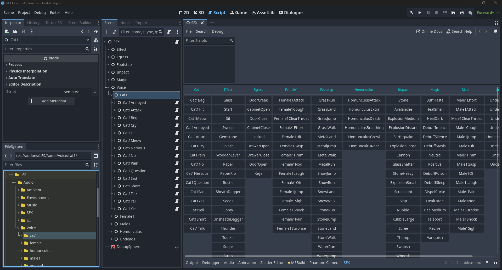

# SFX - A Sound Effects Player for Godot



## Quick Start

1. Copy contents into `res://addons/sfx/`
2. Enable in Project Settings > Plugins
3. Create SFX.tscn with Node root, attach `sfx.gd` script
4. Add SFXBridge.cs as child node (for C# support)
5. Add autoload: `SFX.tscn` as "SFX"

## Setup

### 3D

Create an SFX scene with the following heirarchy,

```
SFX (Node, sfx.gd)
├── DoorOpen (Node, sound_group_3d.gd)
│   ├── door_open_01 (AudioStreamPlayer3D)
│   ├── door_open_02 (AudioStreamPlayer3D)
│   └── door_open_03 (AudioStreamPlayer3D)
└── DoorClosed (Node, sound_group_3d.gd)
	└── door_closed_01 (AudioStreamPlayer3D)
	└── and so on...
```

Tag your main camera with group "MainCamera" or call `SFX.set_main_camera(camera)`.

## Usage

**GDScript:**
```gdscript
SFX.play("DoorOpen")                    # at camera position
SFX.play_sound("Footstep", position)   # at specific location
```

**C#:**

Add `SFXBridge.cs` as an Autoload, then use,

```csharp
var sfx = GetNode<SFXBridge>("/root/SFX/SFXBridge");
sfx.PlaySound("DoorOpen", Position);
```

## Sound Groups

Each SoundGroup3D group applies their respective settings to the pool they manage,

- `max_voices`: Concurrent sounds
- `vary_pitch`: Random pitch range
- `vary_volume`: Random volume range

## Editor Preview

Open any scene with root named "SFX" and use the bottom SFX panel to test sounds without running the game.

## 2D Audio

For non-3D sounds (UI, music), use SFX2D - a simpler version without spatial positioning.

### Setup

Create SFX2D.tscn with the following hierarchy:

```
SFX2D (Node, sfx2d.gd)
├── Accept (AudioStreamRandomizer)
└── Cancel (AudioStreamRandomizer)
└── and so on...
```

Add autoload: `SFX2D.tscn` as "SFX2D"

### Usage

**GDScript:**
```gdscript
SFX2D.play_sound("Accept")
SFX2D.play_sound("Cancel")
```

**C#:**
```csharp
var sfx = GetNode<SFXBridge>("/root/SFX/SFXBridge");
sfx.Play2D("Accept");
sfx.Play2D("Cancel");
```

## Files

- `sfx.gd` - Main 3D audio system
- `sfx2d.gd` - Simple 2D audio for non-3D sounds
- `sound_group_3d.gd` - Manages sound variations
- `sfx_plugin.gd` - Editor integration
- `sfx_preview_dock.gd` - Preview interface

## License

MIT by Paul Hill
